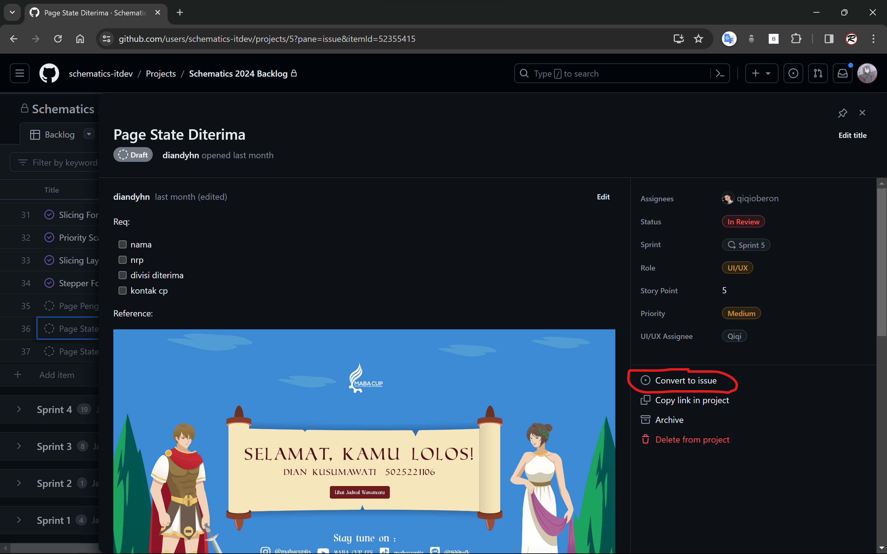
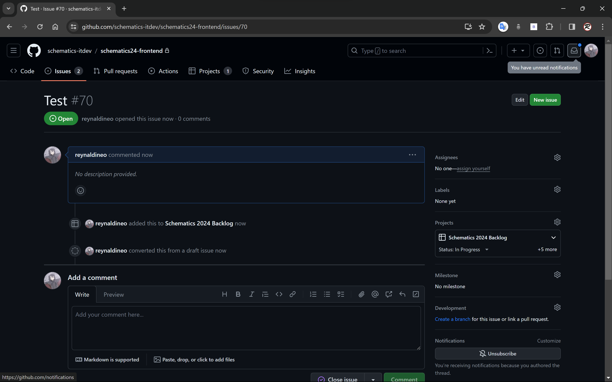
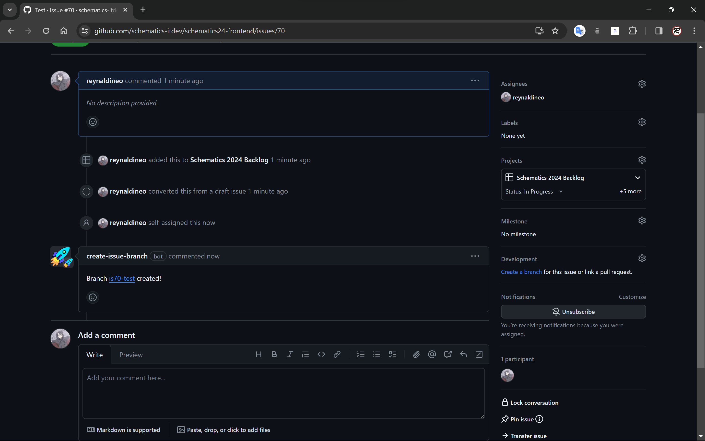

# Pencerdasan IT Dev Schematics 2024

## Setup repo local

1. Clone repo https://github.com/schematics-itdev/schematics24-frontend.git ke folder local
2. Download PNPM (kalo belom punya)
3. Open folder dan run `pnpm install`
4. Buat test run `pnpm dev`

## Workflow

Workflow yang digunakan di IT Dev Schematics 2024 adalah menggunakan agile development yang menggunakan sistem Scrum dan Sprint. Sprint yang digunakan berdurasi 1 minggu dan Scrum diadakan setiap hari Senin jam 7 dan ketika puasa jam 9.

Untuk pengerjaan task, pertama task akan dimasukkan dari backlog github project dan diassign ke masing-masing staff. Dari ticket github project tersebut, kita bisa membuat issue berdasarkan ticket tersebut.

Ketika sudah diubah menjadi sebuah issue, kita bisa assign diri kita ke menu Asignees, dan secara otomatis branch baru akan dibuat.

Setelah branch tersebut sudah dibuat, kita bisa melakukan `git fetch` pada repository local kita, dan melakukan `git checkout ${nama_branch}`. Setelah sudah masuk ke dalam branch pengerjaan kita, kita bisa langsung mengerjakan task kita.

Jika kita sudah selesai mengerjakan task kita, kita perlu melakukan beberapa command git, yaitu:

1. `git add .` atau `git add ${nama file yg ingin dicommit}`
2. `git commit -m "${commit_message}"`
3. `git fetch origin`
4. `git pull --rebase origin main`
5. `git push -u origin ${nama_branch}`
6. Lalu setelah berhasil dipush ke github, kita bisa membuka respositorynya dan membuat pull request baru.

Ada hal yang perlu diperhatikan ketika ingin melakukan commit, yaitu penamaan commit yang kita lakukan. Di IT Dev Schematics 2024, kita menggunakan <a href='https://www.conventionalcommits.org/en/v1.0.0/'>conventional commit message</a> untuk melakukan penamaan pada commit kita. Hal ini digunakan untuk membuat penamaan commit kita lebih terstandarisasi, dan juga deskriptif.

## Library

Ada beberapa library yang digunakan di development frontend Schematics 2024, diantaranya adalah React-Hook-Form, React-Query, dan Tailwind.

### React-Hook-Form

<a href='https://react-hook-form.com/'>React-Hook-Form</a> adalah library yang digunakan untuk membuat form kita menjadi semakin mudah dalam menjalankan function dan juga dalam handling error. React-Hook-Form juga sangat mudah digunakan untuk menangani form yang kompleks dan mudah diintegrasikan menggunakan library ui yang lain. React-Hook-Form juga secara otomatis dapat membuat validasi realtime di dalam form kita. React-Hook-Form juga mempunyai built-in state container jadi meminimalisir terjadinya prop drilling pada form dan component input kita.

### React-Query

<a href='https://tanstack.com/query/v3/'>React-Query</a> adalah library yang memudahkan kita dalam proses fetching, create, update, dan juga delete dalam penggunaan API. React-Query memiliki beberapa hooks yang membuat handling error, dan beberapa state lainnya menjadi lebih simple, mencegah manual refetching, declarative dan lebih efisien. Contoh dari hook tersebut adalah useQuery dan useMutation. Pada useQuery, kita dapat mengambil data, dan juga error langsung dari hook tersebut sehingga meminimalisir penggunakan usestate pada aplikasi kita. Pada useMutation, kita bisa mengetahui apakah mutation kita sedang loading, tanpa harus menggunakan state tambahan, dan dapat mengetahui status dari mutation kita seperti success, error, dan lain-lain.

### Tailwind CSS

Tailwind CSS adalah library yang memanfaatkan CSS dan menggunakan stylingnya langsung dari className html yang kita gunakan. Tailwind sangat mempercepat development frontend dalam slicing, dan sangat mudah diintegrasikan ke dalam aplikasi kita. Tailwind juga memudahkan kita untuk membuat design yang responsive karena memiliki breakpoint default yang kita bisa langsung digunakan dalam class kita. Tailwind juga dengan mudah menghandle styling ketika statenya berubah, seperti ketika dihover, ketika active, dan lain-lain.

## Next.JS 14

Next.JS adalah framework React yang digunakan untuk membuat aplikasi web yang lebih optimized karena menggunakan Server Side Rendering (SSR). Fitur utama yang dimiliki oleh Next.JS adalah routing yang lebih mudah, memiliki client side rendering dan server side rendering, optimisasi image, font, dan scripts, dan juga support yang kuat untuk Typescript.

### Tipe Component

Di Next.JS 14, route dalam Next.JS dibedakan menjadi 2, yaitu App router dan Page router. App router adalah router yang lebih baru dan kita bisa menggunakan fitur React yang terbaru seperti Server Components dan Streaming. Sedangkan Page router adalah router original dari Next.JS yang digunakan untuk membuat server-rendered react components.

Perbedaan dari kedua router ini cukup signifikan, dan perbedaan terbesarnya ada di React Componentnya. Pada app router, kita harus mendeklarasikan `'use client'` di paling atas component kita untuk aplikasi yang memerlukan client rendering, seperti menggunakan useState hook dan lain-lain.

### Optimizing Server and Client Component

Cara kita mengoptimasi aplikasi kita adalah dengan menggunakan client component seperlunya. Ada beberapa contoh penggunaan client component dan server component yang baik sehingga kita meminimalisir penggunaan cient component yang redundant dan terlalu besar.

example: <a href='https://x.com/asidorenko_/status/1752650462556287301?s=46'>Better practice for client partent</a>

## Design System

Di workspace frontend, sudah disediakan beberapa komponen yang membuat pengerjaan kita menjadi lebih cepat dan konsisten. Salah satu dari komponen tersebut adalah komponen Typography. Pada komponen Typography, kita bisa memilih variant, font, dan weight yang akan digunakan.

Design system ini bertujuan untuk membuat hasil yang lebih konsisten, karena memiliki dasar komponen yang sama.

## Clean Code

Clean code adalah salah satu aspek penting dalam pengembangan sebuah software/web. Untuk mendapatkan hasil yang maksimal, dan mempermudah orang lain membaca hasil coding kita, sebaiknya clean code ini diterapkan.

Aturan umum clean code yaitu:

1.  Mengikuti standart umum bahasa pemograman
2.  KISS (Keep It Simple Stupid), diusahakan untuk selalu meminimal mungkin dalam mengimplementasikan kode.
3.  Cari akar permasalahan, jangan hanya bagian-bagian sekitar yang terkena dampak kode tersebut.

Tips for writing cleaner code:

1.  Effectiveness, Efficiency and Simplicity
2.  Format and Syntax: Indentation and spacing, Consistent syntax
3.  Reusability
4.  Only Expose and Consume Data You Need
